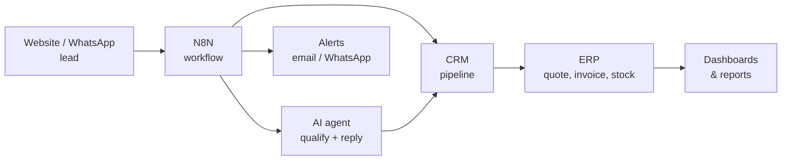

<!-- Mohammad Rameez Imdad (Rameez Scripts) — Founder | ERP Systems | CRM Systems | N8N Automation Workflows | AI Automation | Custom Business Software | Google Apps Script | PHP 8 / MySQL | React 18 -->

# Mohammad Rameez Imdad

**Founder, [Rameez Scripts](https://rameezscripts.com)**
**ERP · CRM · N8N Automation · AI Automation**

I build **professional business systems**: ERPs that run operations, CRMs that manage every customer, and N8N and AI automations that do the repetitive work in between. I take each system from the first requirements call through database design, build, deployment, training and support, for businesses worldwide.

| **400+** | **50+** | **4.9 / 5** | **30K+** | **348+** |
|:---:|:---:|:---:|:---:|:---:|
| systems & projects shipped since 2022 | countries served | from 187+ client reviews | YouTube subscribers | free tutorials |

---

## What I build

<table>
<tr>
<td width="50%" valign="top">

### ERP Systems

One system to run the whole business, not ten disconnected spreadsheets.

- Inventory, stock ledger and multi-warehouse
- Purchasing, sales, invoicing and POS
- Accounting, ledgers, expenses and cash book
- HR, attendance and payroll
- Multi-branch, with role-based access for every department
- Audit logs, dashboards and CSV / PDF reports

</td>
<td width="50%" valign="top">

### CRM Systems

Every lead, client and conversation in one place, with nothing forgotten.

- Lead capture from web forms, WhatsApp and imports
- Sales pipelines with stage tracking
- Quotations, follow-ups and reminders
- Support tickets with SLA timers
- Call-center and client portals
- WhatsApp and email communication history

</td>
</tr>
<tr>
<td width="50%" valign="top">

### N8N Automation Workflows

Processes that run on their own, 24/7, and log every run.

- Website forms to Google Sheets, CRM or database
- Lead routing and instant WhatsApp or email alerts
- Booking and appointment agents
- Scheduled reports and daily summaries
- API integrations between the tools you already use
- Webhooks, retries and error notifications

</td>
<td width="50%" valign="top">

### AI Automation

AI that does real work inside your system, not a demo chatbot.

- AI agents built on N8N workflows
- AI assistants that answer questions from your business data
- Automated quotations and requirement intake
- AI-assisted search and product matching
- Document and message processing
- Self-hosted LLMs for private data (Ollama)

</td>
</tr>
</table>

Also: **payment gateway integration** (PayFast, Safepay, Bank Alfalah), **Google Sheets web apps** with Apps Script back ends, and **admin dashboards** in React 18.

---

## How an automated business fits together

I build every piece of this chain, so the systems are designed to talk to each other from day one.

---

## Industries I've built for

---

## How I work

1. **Requirements first.** Real pain points, roles and workflows are mapped before anything is designed.
2. **Schema first.** The data model is designed and reviewed before any screen: strict types, foreign keys, indexes.
3. **Secure by default.** Prepared statements, server-side role checks, CSRF protection, rate-limited logins, full audit trail.
4. **Fast with real data.** Batched reads and writes, indexed lookups, no queries inside loops.
5. **Delivered in phases.** Clients see working software early and often, then get training and support after launch.

---

## Tech stack

   
   
  

  
  
  
  
  
  
   
  
  
  
  

---

## Teaching

I build complete business systems on camera, from an empty sheet to a deployed app, with nothing skipped.

| Channel | Focus |
|---|---|
| **[@rameezimdad](https://www.youtube.com/@rameezimdad)** | Google Sheets, Apps Script, N8N and AI automation · 30K+ subscribers |
| **[@RameezScriptsDEV](https://www.youtube.com/@RameezScriptsDEV)** | PHP 8 and MySQL ERP, CRM and business apps |

---

## Background

| | |
|---|---|
| **Education** | BS Computer Science, Minhaj University Lahore |
| **Company** | Rameez Scripts: PSEB-registered software company (Pakistan) · MSME / Udyam-registered start-up (Government of India) |
| **Offices** | Lahore, Pakistan (HQ) · Hyderabad, India · Windsor, Canada |
| **Delivery** | Built in-house, no outsourcing · 6 months of free WhatsApp support on every custom project |

---

### Let's Work Together

Need an ERP, a CRM or an automation that removes hours of manual work?
Open to projects worldwide · Remote · Lahore, PKT (UTC+5)

<!-- SEO: Mohammad Rameez Imdad, Rameez Scripts, ERP developer, custom ERP system, CRM developer, custom CRM, N8N automation expert, N8N workflow developer, N8N AI agent, AI automation, AI agents for business, business process automation, workflow automation, Google Apps Script developer, Google Sheets automation, PHP MySQL ERP, POS system developer, inventory management system, HR payroll system, payment gateway integration, WhatsApp automation, self-hosted LLM, custom business software, full-stack developer Lahore Pakistan, remote developer -->
